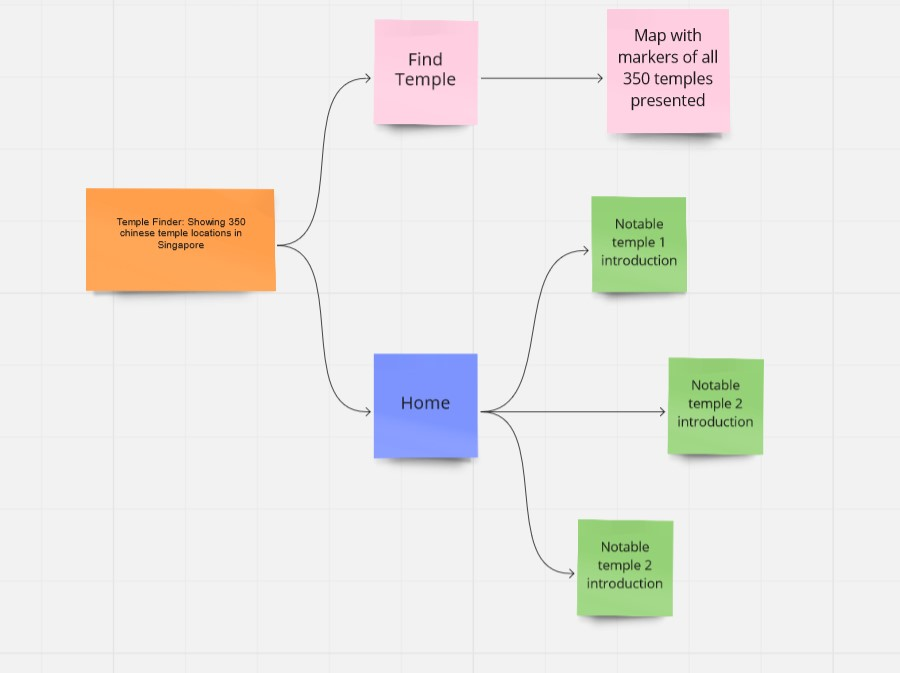

# Temple Finder: Showing chinese temple locations in Singapore
Access live demo site [here](https://sg-temple-locate.netlify.app/)

## Overview

Main purpose of the project is to provide users with knowledge of where chinese temples are located including the famous ones 

### Organization's Goals
The goal of the site is to provide quicker access to location of chinese temples. It also provides recommended routing to temples based on postal codes. The site aims to consolidate information of temples along with nearby MRT stations and vegetarian eateries presented with basic website interaction

### Users' Goals
General public users who are interested should be able to easily find a way to a desired temple from
where they are using postal codes. They would also be able to plan ahead of their trip by checking current weather, vegetarian food places as part of after prayers rituals and nearest MRT stations

---

## The Five Planes of UI/UX

### Strategy

1. **Organisation**
   - Objective: To bridge the knowledge gap and act as a platform to provide information that allows easy planning of prayer trips
2. **Users: General Public**
   - Objective: Be able to easily locate chinese temples and plan for any prayer trips
   - Demographics:
       - Anyone who wants to have a prayer session to find a peace of mind
   - Pain point: Unsure of which chinese temple to visit and need recommendations
3. **Users: Millenials and Gen Zs**
   - Objective: Extrapolate their current state of chinese religious knowledge by allowing them to plan prayer trips more effectively
   - Needs:
      - Recommendations of reputable chinese temples
      - Able to check for weather and plan ahead of their trip
      - Need some basic understanding of main patron deities their elders pray to
   - Demographics:
      - Millenials and Gen Zs seeking to understand certain traditions that they watch their elders do but no idea why it is being done
      - Millenials and Gen Zs seeking to carry on their parents and chinese cultural traditions but the older generation is unable to connect with them to provide such information
   - Pain point: Not much information on the internet for the tech-savvy younger generation regarding these traditions. The older generation do not possess enough tech knowledge to share what they know on the internet

User Stories | Acceptance Criteria(s)
------------ | -------------
As part of the younger generation not educated on such religious matters from parents generation, I would like to visit some of the chinese temples that my elders frequently visit including how to get there myself | Map should be able to provide a route from the starting point to destination temple location using starting location postal code and temple postal code as inputs
As someone from the general public that already has knowledge about these religous matters and is planning a prayer trip or being there physically after prayers, I like to be able to get information about surrounding amenities and weather information of the temple | Site should be able to allow users to check nearby vegetarian eateries, weather information and nearby MRT stations when interacting with the temple markers

### Scope

#### Content
The site should at least contain location markers of 350 temples spreaded across the mainland island of Singapore with some outlying temples in outlying islands like Pulau Ubin. It must be able to provide users with information of nearby transport and vegetarian food. Weather forecast must also be available at all the temples

#### Functional
- Route provided from start to destination based on postal code inputs
- Interaction with the temple markers will provide location of vegetarian food eateries and nearby MRTs
- Temple marker popups includes information of the current realtime weather 

### Structure
<figure>
    
    <figcaption>Information Architecture and Design of the site</figcaption>
</figure>

1. Loading of the site will bring user to the main page of the site
2. Each of the card shown represent one of the 3 most notable and famous chinese temple in Singapore that will take you to the temple marker on the map
3. Individual Map itself will show all the 350 listed temples in Singapore as markers, access it through navbar
4. Map allows users to find route from point A to point B using their postal codes and check information on their destination by clicking on their marker

### Surface

#### Color Scheme

<figure>
    
    <figcaption>Website color scheme</figcaption>
</figure>

- The primary color used is black and grey to complement the younger generation taste in monochrome
- Darker colours like black and grey help to bring out the minimalistic feels that appeals to the younger age group of the target audience
- Brighter colors are chosen to be used emphasized content
- Lighter colors are used as accents such as shadows and backgrounds

#### Icons
Font awesome icons are also used to denote social media platforms, map markers are sourced from flaticon free icons website

---

## Testing
Test Cases can be found [here](./testcase/testcases.pdf)

---

## Possible Enhancements

- Mobile responsiveness for phones is still incomplete. This is especially so for small phones.
- Temple Data: Only consist of location data and not much else to include (E.g. main deities, opening hours and postal code address)

---

## Challenges and Constraints

1. Temple location data is not readily availabe as API or JSON file. 
2. Forward geocoding using raw address instead of postal codes will return an array of locations. Sometimes the intended latitude and longitude is present within the array but sometimes the array returned only contains latitude and longitude of locations that are nearby the intended latitude and longitude coordinate.
3. Forward geocoding using postal code will sometimes return results even though the postal code inputted is invalid. This is because the geocoding API by mapbox will truncate and match the input with a postal code that is not the intended location.

---

## Libraries and Sources

### Technologies Used

1. [Font Awesome](https://fontawesome.com/) for social media platform icons used
2. [AXIOS](https://axios-http.com/docs/intro) for AJAX requests
3. [Leaflets](https://leafletjs.com/) for the displayed map
4. [Leaflets](https://www.liedman.net/leaflet-routing-machine/) for the routing plugin
5. [Git](https://git-scm.com/) for version control
6. [GitHub](http://github.com) for the repository
7. [Netlify](https://www.netlify.com/) for deployment
   
### Data Sources

1. data.world to get data on MRT station locations
   - https://data.world/hxchua/train-stations-in-singapore/workspace/file?filename=mrtsg.csv
2. Weather data API
   - https://openweathermap.org/api
3. Foursquare API
   - https://foursquare.com/products/places-api/
4. Geocoding API
   - https://docs.mapbox.com/api/search/geocoding/

### Other Attributions
1. [Paul Chor](https://github.com/kunxin-chor) for all his guidance and using his tutorials as references for the codes 
2. [List of Singapore temples](http://www.beokeng.com/list.php) for obtaining the list of temple location from its page source
3. [Unsplash](https://unsplash.com/s/photos/chinese-temples) for background image used in main page
4. [Coolors](https://coolors.co/80deea-ffc0cb-afe1af-adb5bd-f5f5dc-1b1b1b) for the colour theme explanation used in this readme file

---

## Build and Deployment

### Deployment

The web app is hosted using [Netlify](https://www.netlify.com/).

Prerequisites:
- Any edits done were added, commited, and pushed to Github repository
- Netlify is connected and authorized to Github account
- Netlify is connected to GitHub repository via "New site from Git"
- "GitHub"  has been selected for continuous deployment

Steps to publish[^1]:
1. Go to Netlify and select the team that site has been set up with
2. Browse to the site that needs to be published
3. Go to Deploys and select the deployment to be published

---

[^1]: Steps are only required when auto-publishing is disabled